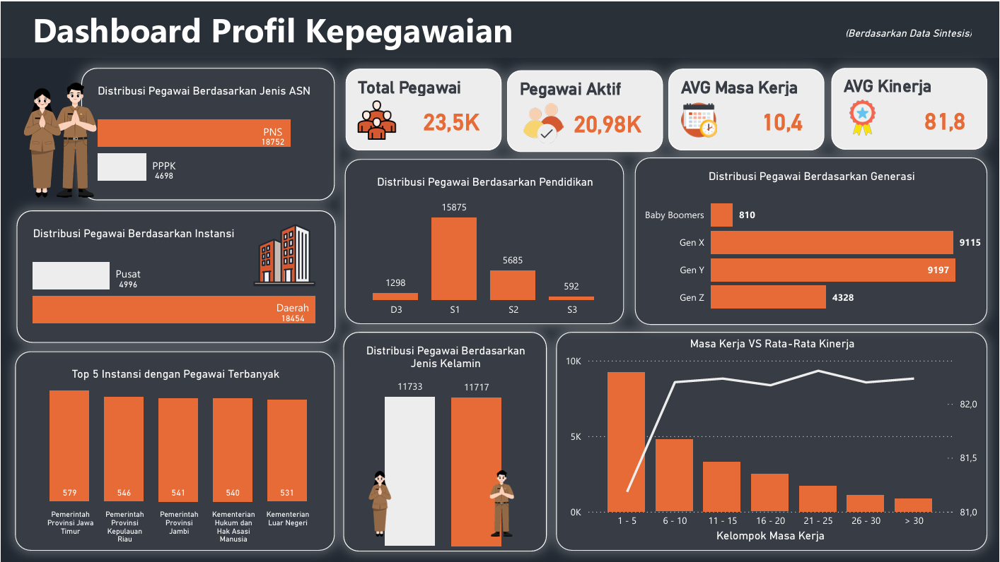

# Employee Data Management & ETL Process

A simulation project that demonstrates an end-to-end data workflow, starting from an **operational database**, continuing through an **ETL process**, and ending with a **Business Intelligence dashboard**.

The project simulates how operational employee data stored across multiple relational tables can be integrated and transformed into an analytical dataset for reporting and visualization.

> **Project Type:** Simulation Project  
> **Domain:** Human Resources / Employee Analytics  
> **Tools:** PostgreSQL, Python, ETL, Power BI

---

## 📊 Dashboard Preview



The dashboard provides an overview of employee demographics, organizational
distribution, tenure, and performance.

## 📌 Project Overview

Employee operational data is stored across multiple related tables. To make the data suitable for analysis, the data is extracted, transformed, integrated, and loaded into an analytical dataset.

The ETL process is implemented using Python, while Power BI is used to create an employee profile dashboard.

The overall workflow is:

```text
Operational Database
        │
        ▼
     Extract
        │
        ▼
     Transform
        │
        ▼
       Load
        │
        ▼
Analytical Dataset
        │
        ▼
   Power BI Dashboard
